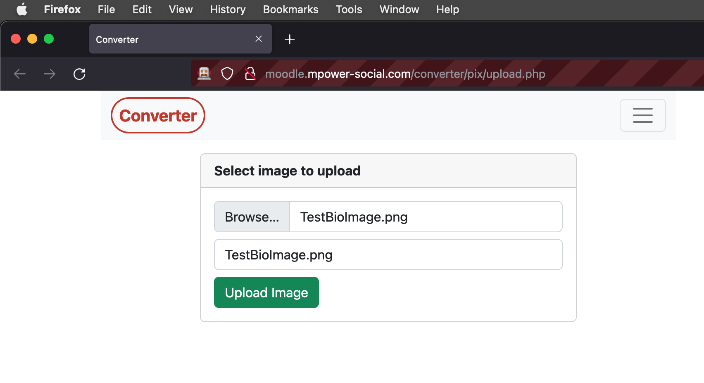

# Automated Bot Image Uploader

<div align="center">
   
</div>

This repository contains an image uploader BOT to upload bulk images to a website.
## Installation

Use the package manager [pip](https://pip.pypa.io/en/stable/) to install foobar.

```bash
pip install selenium
```

```bash
pip install webdriver-manager
```

## Usage

```python
© Akif Islam | 2022

from selenium import webdriver
from selenium.webdriver.common.keys import Keys
from selenium.webdriver.common.by import By

driver = webdriver.Firefox(executable_path='/Users/akifislam/SeleniumEngines/geckodriver')
driver.get("http://moodle.mpower-social.com/converter/pix/upload.php")
driver.maximize_window()

#Searching specific area to fillup a form
driver.find_element(By.ID,'imgfile').send_keys("/Users/akifislam/PycharmProjects/PlumberTest/TestBioImage.png")
driver.find_element(By.ID,'imgname').send_keys("TestBioImage")
driver.find_element(By.NAME,'submit').send_keys(Keys.RETURN)

#Close the browser
driver.close()
```

## Contributing
Pull requests are welcome. For major changes, please open an issue first to discuss what you would like to change.

## Setup Procedure
* Use Firefox (Recomended) or Chrome Web-Driver to work with Selenium
* Download Firefox Webdriver from [here](https://github.com/mozilla/geckodriver/releases)
* Download Chrome Webdriver from [here](https://chromedriver.chromium.org/downloads)
* Provide Proper permission to open the webdriver. For mac, Go to System Preference and Allow.
* Also you can give root permission to any file by
```bash
chmod 755 <filepath>
```
* Finally Add Webdriver to PATH

# Adding a PATH on macOS
##### 1. Open up Terminal.
##### 2. Run the following command: sudo nano /etc/paths.
##### 3. Enter your password, when prompted.
##### 4. Go to the bottom of the file, and enter the path you wish to add.
##### 5. Hit control-x to quit.
##### 6. Enter “Y” to save the modified buffer.

## License
[MIT](https://choosealicense.com/licenses/mit/)

© Copyright 2022 | Akif Islam
